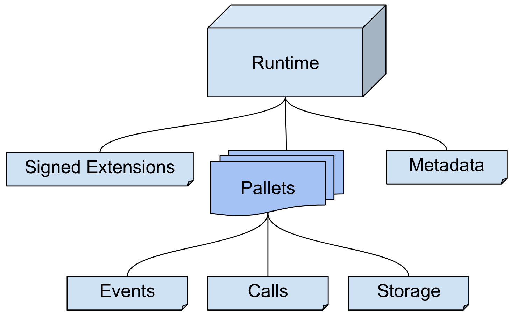

本仓库存储本人的本科毕业设计相关的文档、代码和开发日志。

# 开发日程

# 基于geth1的出租车调度系统复现

# 英文文献翻译工作

# 树状区块链跨链转账测试

# 讨论纪要

## 2023-04-??的讨论

1. 最终的版图：将区块链作为一个系统服务，能够像调用CreateProcess那样的API供用户使用
2. 作为系统服务的难度仍然很大，那么作为平替，让区块链作为一个可以在浏览器中能运行的服务，只要有浏览器就能运行，也是一个很好的设想
3. 在浏览器中运行的虚拟机就是WASM，也就是说，我们应该尝试将现有的、基于EVM的区块链应用给迁移到WASM上，这要求我们不使用Solidity，而是使用像Rust这样能够编译为WASM支持的高级语言来写合约
4. 至此，引出本科毕设的自主研究内容，使用支持编译为WASM可运行的区块链平台（例如Substrate），用可编译为WASM的高级语言翻译现有合约（不必要求全翻译完）
5. 参考资料如下：
   - [WebAssembly 概念 - WebAssembly | MDN (mozilla.org)](https://developer.mozilla.org/zh-CN/docs/WebAssembly/Concepts)
   - [一文读懂 WebAssembly （WASM）智能合约_Rust (sohu.com)](https://www.sohu.com/a/462896257_100217347)
   - [了解区块链虚拟机：EVM、HVM、WASM、MOVE - 知乎 (zhihu.com)](https://zhuanlan.zhihu.com/p/596991126)
   - [Ethereum WebAssembly (ewasm) - Ethereum WebAssembly](https://ewasm.readthedocs.io/en/mkdocs/)
   - [以太坊2.0-Ewasm | 登链社区 | 区块链技术社区 (learnblockchain.cn)](https://learnblockchain.cn/article/716)

## 2023-04-24的讨论

1. 把修改区块链底层，为交易引入“地理位置”的新属性；这项工作在现在做不现实，跨度太大
2. Substrate链和链外应用有暴露接口，可以从这个方面入手，研究链外的请求是如何一步步地被送入区块链的
   - 可以参考[Offchain HTTP Requests](https://docs.substrate.io/reference/how-to-guides/offchain-workers/offchain-http-requests/)和[PolkaDot{.js}](https://polkadot.js.org/)
3. 接下来可以翻译Substrate文档的Tutorials部分，先从get-started开始翻译，后续可以部署成网站，将来找工作会有优势
4. 学习主动性需要提升，设计过程需要循序渐进，过程需要多留记录

# 调研纪要

## 2023-04-26

### Q: Substrate上的所谓“交易”（Extrinsics）到底是怎么回事？
[Day in the Life of a Substrate Extrinsic](https://blog.unit410.com/polkadot/kusama/substrate/2022/06/02/day-in-the-life-of-a-substrate-extrinsic.html)

由Unit410编写，不仅讲了交易，甚至连Runtime，Pallet，Call的概念都理清楚了，好物！

###Q: Substrate的区块结构是什么样的？

[new Bing给出的参考资料](https://stackoverflow.com/questions/70325963/substrate-blockchain-change-block-structure)

Substrate区块的结构是通用的。区块头需要实现sp_runtime库中的Header trait，而区块需要实现Block trait。Substrate本身已经提供了两种类型，分别是sp_runtime库中的Block和Header。当您设置区块链时，主要是通过运行时来选择这些类型1。

您可以在运行时定义中找到这些定义，例如：`pub type Header = generic::Header<BlockNumber, BlakeTwo256>;`。您可以更改它以包括您想要添加的任何其他数据。

###Q: Substrate的区块头是什么样子？定义在哪里？

Substrate提供了一个默认的区块头模板，位于primitives/runtime/src/generic/header.rs文件中。这个模板定义了以下字段：

- parent_hash：父区块的哈希值。
- number：区块号。
- state_root：状态根，是对区块执行后状态变更的证明。
- extrinsics_root：交易根，代表了该header下的区块体中交易的内容与顺序，是对区块信息的摘要。
- digest：区块附加信息。（我的理解：摘要，可能是某种Hash之后的结果）

开发人员可以使用这个模板，也可以定义自己的区块头结构。但是，由于区块头中包含的一些证明及一些属性与区块链的运行过程（基于状态）、共识（共识证明）等方面是“强耦合”的，因此一般情况下在Substrate中使用的区块头都直接使用了Substrate默认提供的，极少有需求需要对其进行更改。

###Q: Substrate的世界状态树是怎样的？

[new Bing给出的参考资料](https://learnblockchain.cn/2019/12/22/substrate-state/)

Substrate沿用了以太坊的设计，在Substrate中只有状态树，即使是合约的功能也不专门存在合约的存储树。Substrate使用Merkle Patricia树（也称为Trie树）来存储世界状态。每个账户都有一个唯一的地址，该地址用作键值，而账户的相关信息（如余额、合约代码和存储）则存储在值中。这些键值对被插入到Trie树中，形成了一个加密安全的数据结构。

每次区块链状态发生变化时（例如，当交易被执行时），Trie树都会相应地更新。更新后，Trie树的根哈希也会改变。这个根哈希就是区块头中的State Root字段。

Substrate使用RocksDB数据库来持久化存储Trie树。这样，在节点重新启动时，可以从数据库中重新加载世界状态。

###Q: 状态树的数据结构定义在哪里？可以增删数据吗？

是的，在Substrate中，状态树被描述为一个Merkle Patricia树（也称为Trie树）数据结构。这个数据结构定义在substrate-trie库中，该库位于Substrate代码库的primitives/trie目录下。

substrate-trie库提供了一组用于操作Trie树的API，包括插入、删除和查找键值对等操作。这些API被封装在TrieDB和TrieDBMut两个结构体中，分别用于只读和可写访问Trie树。

此外，Substrate还提供了一组用于操作状态树的高级API，这些API定义在frame-support库中。开发人员可以使用这些API来读取和修改状态树上的数据，而无需直接操作底层的Trie树。

###Q: Substrate中的状态树是可以认为是一个键值对结构吗？如果是，它的键是什么样的呢？

是的，Substrate中的状态树可以认为是一个键值对结构。它使用Merkle Patricia树（也称为Trie树）来存储键值对。

在Substrate中，键通常是一个字节数组，它由模块前缀、存储项名称和可选的存储项参数组成。模块前缀和存储项名称用于标识特定的存储项，而可选的存储项参数则用于区分同一存储项的不同实例。

例如，假设我们有一个名为Balances的模块，它定义了一个名为TotalIssuance的存储项来存储当前发行的代币总量。那么，这个存储项在状态树中对应的键就是由模块前缀Balances和存储项名称TotalIssuance组成的字节数组。

Substrate提供了一组用于构造键的宏，开发人员可以使用这些宏来方便地构造键。例如，可以使用module_prefix宏来获取模块前缀，使用storage_prefix宏来获取存储项名称。

###Q: 在Substrate中，有关账户的信息是由哪个模块管理的呢？

[笔者找到的关于账号的数据结构的资料](https://docs.substrate.io/reference/account-data-structures)

在Substrate中，有关账户的信息通常由frame-system库中的System模块管理。这个模块提供了一组用于管理链上账户的基本功能，包括创建和删除账户、查询账户信息等。

此外，Substrate还提供了其他一些模块来管理与账户相关的特定信息。例如，Balances模块用于管理账户余额，Indices模块用于管理账户索引，Session模块用于管理验证人会话密钥等。

开发人员可以在自己的Runtime中使用这些预定义的模块，也可以定义自己的模块来管理与账户相关的信息。

###Q: 我可以编辑frame-system的System模块的源代码，给账户增添一些新属性吗？

是的，您可以编辑frame-system库中的System模块的源代码，给账户增添一些新属性。不过，这样做可能会影响到其他依赖于System模块的模块，因此需要谨慎操作。

另外，您也可以考虑在自己的Runtime中定义一个新的模块来管理与账户相关的新属性。这样做可以避免直接修改System模块的源代码，同时也更容易维护和扩展。

例如，您可以定义一个名为AccountExtension的模块，用来管理与账户相关的新属性。在这个模块中，您可以定义存储项来存储新属性的值，并提供可调用函数来查询和修改这些值。然后，在您的Runtime中引入这个模块，并在其他模块中使用它来管理与账户相关的新属性。

###Q: 如果我确实希望直接修改System模块的代码，我可以在哪里找到它？编辑完成之后，如何将它引入我的runtime中呢？

如果您确实希望直接修改System模块的代码，您可以在Substrate代码库的frame/system目录下找到它。这个目录中包含了System模块的源代码，您可以在这里编辑它。

编辑完成后，您需要重新编译Substrate代码库，以便生成新的可执行文件。然后，在您的Runtime中，您可以像引入其他模块一样引入修改后的System模块。

###Q: Substrate中的frame_support::traits::StoredMap是什么？

StoredMap是Substrate中frame_support库的traits模块中定义的一个trait。它提供了一种在存储中存储键值对的方法。您可以在[这里](https://docs.rs/frame-support/latest/frame_support/traits/trait.StoredMap.html)查看它的文档。

###Q: Substrate中的types::AccountData是什么？

AccountData是Substrate中的一个数据类型，它是在frame-system pallet中定义的，路径位于frame/balances/src/types.rs。它是一个存储映射，用于存储账户信息。您可以在[这里](https://docs.substrate.io/reference/account-data-structures/#accountdata-trait-and-implementation)查看有关它的更多信息。
